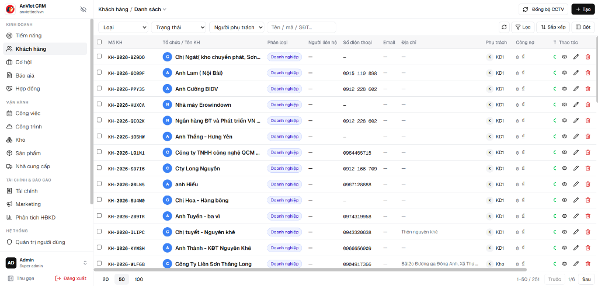

# QUY CHUẨN THIẾT KẾ UI/UX CHUẨN DOANH NGHIỆP (ENTERPRISE ERP)
## DỰ ÁN: SIGNAGE ERP - HỆ THỐNG QUẢN TRỊ DOANH NGHIỆP BIỂN QUẢNG CÁO
**Mục tiêu tài liệu:** Định hình tiêu chuẩn giao diện người dùng thực tế, chống các lỗi thiết kế phổ biến của AI, tối đa hóa mật độ thông tin và tối ưu trải nghiệm thao tác tốc độ cao.

---

## 1. Hình Ảnh Chuẩn Mẫu Thực Tế (Benchmark UI)

Mọi màn hình danh sách, quản trị dữ liệu trong hệ thống **bắt buộc phải học tập và tuân thủ bố cục như hình ảnh mẫu dưới đây**:



* **Xem ảnh gốc độ phân giải cao:** [ui_standard_reference.png](file:///c:/Users/nhatb/Documents/antigravity/noble-fermi/docs/images/ui_standard_reference.png)
* **Đường dẫn tệp tin trong dự án:** `docs/images/ui_standard_reference.png`

---

## 2. Các Lỗi Sai Kinh Điển Của AI Cần Tránh Triệt Để (Anti-Patterns)

Khi AI tự sinh giao diện web, thường mắc 6 lỗi ngớ ngẩn làm hỏng trải nghiệm người dùng doanh nghiệp:

| Lỗi sai điển hình của AI (Tuyệt đối tránh) | Cách làm chuẩn trong Signage ERP |
| :--- | :--- |
| **1. Nhét tiêu đề to đùng và đoạn mô tả dài ngoằng**: Để chữ to `Quản lý khách hàng` rồi bên dưới viết một đoạn *"Chào mừng bạn đến với trang quản lý khách hàng..."* làm lãng phí 20-30% chiều cao màn hình. | **Tận dụng tối đa diện tích**: Chỉ dùng Breadcrumb thanh mảnh ở trên cùng (`Khách hàng / Danh sách ⌄`). Ngay bên dưới là thanh tìm kiếm và bảng dữ liệu. |
| **2. Dùng giao diện Card to đùng**: Biến danh sách thành các khối thẻ (Cards) cồng kềnh, cuộn mỏi tay chỉ xem được 4-5 bản ghi. | **Bảng dữ liệu mật độ cao (Data Table)**: Hiển thị dạng bảng kẻ dòng sát sao, 1 màn hình máy tính phải xem được ít nhất 15-25 dòng dữ liệu cùng lúc. |
| **3. Icon màu mè sặc sỡ, icon 3D**: Dùng các icon hoạt hình, đủ màu xanh đỏ tím vàng làm giao diện như đồ chơi. | **Icon đơn sắc (Monochrome)**: 100% sử dụng icon đường nét thanh mảnh (stroke 1.5px), màu xám trung tính (`slate-600` / `slate-500`), hover nhẹ nhàng. |
| **4. Các dòng tự động xuống dòng vô tội vạ**: Mỗi cột dài ngắn khác nhau làm dòng cao 100px, dòng cao 30px, bảng nhấp nhô xấu xí. | **Khống chế 1 dòng duy nhất (`whitespace-nowrap`)**: Các ô chữ dài sẽ được cắt gọn bằng dấu ba chấm (`truncate`), hover chuột vào sẽ hiện Tooltip xem đầy đủ. |
| **5. Cắt bớt cột thông tin quan trọng**: Vì sợ chật màn hình nên AI thường giấu cột số điện thoại, ngày tạo, công nợ... | **Đưa tối đa cột cần thiết ra ngoài & Cho phép cuộn ngang (`overflow-x-auto`)**: Cung cấp nút **Bật/Tắt cột** để người dùng tự tick chọn cột muốn xem. |
| **6. Nhồi nhét hàng chục mục con vào Sidebar**: Làm thanh menu dài ngoằng, cuộn mỏi mắt. | **Gom nhóm vào Tab phụ (Sub-tabs)**: Các trang danh mục nhỏ gom vào tab bên trong trang lớn. Sidebar chỉ giữ lại các phân hệ trụ cột. |

---

## 3. Cấu Trúc Bố Cục Một Trang Chuẩn (Page Anatomy)

Một màn hình quản trị chuẩn trong Signage ERP bao gồm 5 khu vực cố định từ trên xuống dưới:

```text
┌─────────────────────────────────────────────────────────────────────────────────────────────────────────┐
│ [Logo + Tên]  Khách hàng / Danh sách ⌄                                     [+ Thêm mới]        │ ◄── 1. Top Bar
├───────────────┬─────────────────────────────────────────────────────────────────────────────────────────┤
│ ≡ KINH DOANH  │ [Loại ⌄] [Trạng thái ⌄] [Phụ trách ⌄] [🔍 Tìm tên/mã/SĐT...]  [🔄] [🔍Lọc] [⇅] [▦ Cột] │ ◄── 2. Toolbar & Filters
│ 👥 Khách hàng │ [📊 Hiện thẻ thống kê: Tổng 251 | Doanh nghiệp 180 | Cá nhân 71] (Ẩn/Hiện tùy chọn)    │
│ 📋 Báo giá    ├─────────────────────────────────────────────────────────────────────────────────────────┤
│ 💼 Hợp đồng   │ [ ] MÃ KH    │ TỔ CHỨC / TÊN KH      │ PHÂN LOẠI │ SỐ ĐIỆN THOẠI │ ... │ THAO TÁC (Ghim)│ ◄── 3. Table Header (Sticky)
│ ≡ VẬN HÀNH    │ [ ] KH-001   │ Công ty Quảng Cáo ABC │ Doanh nghiệp│ 0912 345 678  │ ... │  📞 👁️ ✏️ 🗑️  │
│ 📦 Kho vật tư │ [ ] KH-002   │ Xưởng In Bạt Nam Hà   │ Xưởng đối tác│ 0988 123 456 │ ... │  📞 👁️ ✏️ 🗑️  │ ◄── 4. Table Body (1 line/row)
│ 🏗️ Công trình │ ...          │ ...                   │ ...       │ ...           │ ... │  ...           │
│ ≡ HỆ THỐNG    ├─────────────────────────────────────────────────────────────────────────────────────────┤
│ [◄ Thu gọn]   │ [20] [50] [100] dòng/trang                                      1-50 / 251  [Trước] [1] [Sau] │ ◄── 5. Pagination (Sticky)
└───────────────┴─────────────────────────────────────────────────────────────────────────────────────────┘
```

---

## 4. Đặc Tả Chi Tiết Từng Khu Vực

### 4.1. Thanh Điều Hướng (Collapsible Sidebar)
* **Khả năng thu gọn**:
  * Khi mở rộng (Mặc định - `w-64`): Hiển thị Logo, nhóm phân hệ (Kinh doanh, Vận hành, Tài chính, Hệ thống), Icon + Tên phân hệ đầy đủ.
  * Khi thu gọn (`w-16`): Chỉ hiển thị Icon đơn sắc. Khi hover vào icon sẽ hiện Tooltip tên trang. Tối đa hóa chiều rộng cho bảng dữ liệu.
* **Nút điều khiển**: Nút `[◄ Thu gọn]` đặt ở góc dưới cùng bên trái của Sidebar.
* **Trạng thái tài khoản**: Góc dưới cùng hiển thị Avatar, tên User, Role (`Super Admin`) và nút `[Đăng xuất]`.

### 4.2. Thanh Tiêu Đề Đỉnh (Top Bar)
* **Bên trái**: Breadcrumb dạng danh mục thả xuống (`Khách hàng / Danh sách ⌄`). Cho phép click để chuyển nhanh giữa các chế độ xem đã lưu (ví dụ: *Tất cả khách hàng*, *Khách hàng nợ tiền*, *Khách hàng tiềm năng*).
* **Bên phải**: 
  * Nút chức năng phụ (ví dụ: , `Import`).
  * Nút hành động chính nổi bật: **`+ Thêm mới`** (nền đen hoặc xanh đậm, chữ trắng, có icon `+`).

### 4.3. Thanh Tiện Ích & Bộ Lọc Nâng Cao (Toolbar & Action Bar)
Nằm ngay trên bảng dữ liệu, chia làm 2 cụm:
* **Cụm bên trái (Bộ lọc & Tìm kiếm)**:
  * **Dropdown Lọc**: Dạng menu thả xuống, bên trong có ô tìm kiếm nhanh và danh sách checkbox cho phép **tick chọn nhiều giá trị** cùng lúc (Multi-select checklist).
  * **Ô tìm kiếm đa năng**: Tìm kiếm tức thì theo `Tên / Mã / Số điện thoại / Địa chỉ...`.
  * **Nút [Xóa bộ lọc]**: Tự động xuất hiện khi người dùng đang áp dụng ít nhất 1 bộ lọc, bấm vào sẽ reset bảng về mặc định.
* **Cụm bên phải (Công cụ dữ liệu)**:
  * Nút **Làm mới dữ liệu** (`Reload / Refresh`).
  * Nút **Tùy chỉnh cột** (`Column Visibility`): Mở dropdown danh sách các cột để người dùng tự tick bật/tắt cột muốn xem.
  * Nút **Tải lên / Tải xuống Excel** (`Import / Export`).
  * Nút **Bật/Tắt thẻ thống kê**: Khi bấm sẽ mở ra một dải thẻ nhỏ hiển thị số lượng theo bộ lọc hiện tại (ví dụ: *Tổng số: 251 | Doanh nghiệp: 180 | Công nợ: 45.000.000đ*), kích thước căn chỉnh vừa vặn, không chiếm diện tích cố định.

### 4.4. Bảng Dữ Liệu Dày Đặc (High-Density Data Table)
* **Hàng tiêu đề cột (`<thead>`)**:
  * **Ghim cố định trên cùng (`sticky top-0 z-20`)**: Khi cuộn chuột xuống danh sách dài, tiêu đề cột không bao giờ bị trôi mất.
  * Nền xám nhạt (`bg-slate-50`), viền dưới sắc nét.
* **Các hàng dữ liệu (`<tbody>`)**:
  * **Khống chế 1 dòng duy nhất**: Tuyệt đối không cho phép ô bị đẩy dòng làm phình to bảng. Dùng `whitespace-nowrap` kết hợp `text-ellipsis`.
  * **Cột đầu tiên**: Checkbox chọn từng dòng hoặc chọn tất cả (`Select all`).
  * **Cột định danh (Mã / Tên)**: Kèm avatar chữ cái viết tắt có nền màu phân biệt (ví dụ: tròn xanh dương chữ `C` cho `Chị Ngát`).
  * **Lăn ngang (`overflow-x-auto`)**: Cho phép lăn ngang mượt mà khi có từ 10-20 cột thông tin.
* **Cột Thao tác (Action Column) - Ghim cuối cùng**:
  * **Bắt buộc ghim cố định bên phải (`sticky right-0 bg-white z-10 shadow-[-4px_0_6px_-2px_rgba(0,0,0,0.05)]`)**: Dù cuộn ngang đi đâu thì cột Thao tác luôn nằm cố định ở mép phải màn hình.
  * Chứa các icon thao tác đơn sắc, gọn gàng:
    * 👁️ **Xem chi tiết** (Icon mắt).
    * ✏️ **Chỉnh sửa** (Icon bút chì).
    * 🗑️ **Xóa** (Icon thùng rác, hover màu đỏ nhạt).
    * 📞 **Thao tác nhanh theo nghiệp vụ** (ví dụ: Gọi điện, Ghim lên đầu, Duyệt).

### 4.5. Thanh Phân Trang Ghim Cố Định Đáy (Sticky Footer Pagination)
* **Ghim cố định ở đáy màn hình (`sticky bottom-0 bg-white border-t border-slate-200 z-20`)**.
* **Bên trái**: Cho phép chọn số lượng dòng hiển thị: Nút chọn nhanh `20`, `50`, `100` dòng/trang.
* **Bên phải**: Hiển thị tổng quan `1-50 / 251 bản ghi`, nút chuyển `Trước`, danh sách trang `1`, `2`, `...`, `Sau`.

---

## 5. Quy Chuẩn Tư Duy Tương Tác (Interaction Paradigms)

### 5.1. Thao Tác Thêm Mới & Mã Tự Sinh
* **Hành vi**: Bấm `+ Thêm mới` &rarr; Mở **Modal (Popup Dialog)** hoặc **Slide-over (Ngăn kéo trượt từ phải sang)**.
* **Mã định danh tự động**: Hệ thống tự sinh mã theo quy tắc chuẩn (ví dụ: `KH-2026-B29D0`, `VT-2026-ALU01`, `DA-2026-0012`), nhưng trường này **cho phép người dùng sửa tay** nếu doanh nghiệp đã có mã riêng từ trước.

### 5.2. Chế Độ Xem: Xem Nhanh vs Trang Trung Tâm 360° (Detail Hub)
Hệ thống phân định rạch ròi 2 cấp độ xem dựa trên mục đích công việc:
1. **Xem lướt nhanh (Quick Slide-over / Drawer)**:
   * Áp dụng khi người dùng chỉ cần kiểm tra nhanh các thông số cơ bản hoặc đọc lướt một bản ghi mà không muốn rời khỏi trang danh sách hiện tại.
   * Ngăn kéo mở từ bên phải màn hình trượt ra, cho phép đóng lại tức thì bằng phím `Esc` hoặc bấm ra ngoài.
2. **TỐI QUAN TRỌNG: Trang Trung Tâm Dữ Liệu 360° (Entity Hub Page)**:
   * Áp dụng cho các **thực thể trung tâm (Aggregate Root)** có nhiều mối quan hệ dữ liệu đa chiều.
   * Khi click vào Mã hoặc Tên đối tượng &rarr; Bắt buộc mở ra **1 URL trang riêng biệt**.
   * **Nguyên tắc cấu tạo trang 360°**:
     * **Phần Header cố định**: Tóm lược danh tính đối tượng, trạng thái hiện tại và các nút hành động cốt lõi.
     * **Hệ thống Tab ngang (Horizontal Sub-tabs)**: Đào sâu vào từng miền quan hệ của đối tượng (ví dụ: Tab Thông tin gốc, Tab Các công việc liên kết, Tab Dòng tiền/Công nợ phát sinh, Tab Lịch sử nhật ký hoạt động, Tab Tài liệu/Bằng chứng đính kèm).

### 5.3. Chuyển Đổi Dạng Bảng (Table) & Dạng Tiến Độ (Kanban)
* **Nguyên tắc áp dụng**: Bất cứ khi nào dữ liệu có tính chất **dịch chuyển tuần tự qua các cột mốc/trạng thái (Pipeline / Workflow)**:
  * Phải cung cấp nút chuyển đổi linh hoạt: **`[▦ Dạng Bảng]`** và **`[☷ Dạng Kanban]`**.
  * Chế độ Bảng dùng để thống kê, lọc hàng loạt và xuất dữ liệu.
  * Chế độ Kanban dùng để theo dõi luồng công việc trực quan, hỗ trợ kéo thả thẻ card giữa các cột giai đoạn để cập nhật trạng thái tức thì.

### 5.4. Gom Nhóm Danh Mục Bằng Tab Phụ (Sub-Tabs)
* **Nguyên tắc chống rác Sidebar**: Thanh điều hướng bên trái chỉ dành cho các phân hệ trụ cột lớn.
* **Cách xử lý**: Bất cứ khi nào một phân hệ có các chức năng phụ trợ, bảng tham số cấu hình hoặc danh mục phân loại nhỏ:
  * **Bắt buộc gom thành hệ thống Tab phụ bên trong trang chính**, tuyệt đối không tạo thêm từng mục con riêng rẽ trên Sidebar làm menu bị phình to.

---

## 6. Trạng Thái Phản Hồi & Loading (UX Optimization)

1. **Skeleton Loading (Khung xương nhấp nháy)**:
   * Khi người dùng chuyển trang hoặc lọc dữ liệu, tuyệt đối không để màn hình trắng hay đơ.
   * Ngay lập tức hiển thị bảng Skeleton gồm các dòng xám nhạt chuyển động nhẹ (`animate-pulse`) đúng số cột của bảng thật.
2. **Toast Notification (Thông báo góc màn hình)**:
   * Mọi hành động (Lưu thành công, Đã xóa, Đã sao chép mã) đều phải bắn Toast thông báo góc trên bên phải trong 3 giây.
3. **Optimistic UI (Cập nhật giao diện trước)**:
   * Khi tick chọn hoàn thành một đầu việc, giao diện đổi trạng thái ngay lập tức trước khi server phản hồi, tạo cảm giác mượt mà tức thì.

---

## 7. Tư Duy Ra Quyết Định Thiết Kế (Design Decision Framework)

Tài liệu này cung cấp **cây quyết định (Decision Tree)** và **các mẫu thiết kế giao diện doanh nghiệp phổ biến (Enterprise UI Patterns)** để lập trình viên và AI nhận diện đúng bản chất dữ liệu, lựa chọn đúng hình thái giao diện mà không mắc sai lầm.

---

### 7.1. Cây Quyết Định Lựa Chọn Bố Cục (Layout Decision Tree)

Để quyết định một màn hình nên dùng **Màn hình chuẩn (Data Table)** hay **Giao diện Custom**, hãy dựa vào 4 tiêu chí cốt lõi:

```text
[Bản chất Dữ liệu & Hành vi Người dùng]
  │
  ├── 1. Danh sách nhiều bản ghi phẳng, cần tra cứu, lọc, so sánh và xuất dữ liệu?
  │      └──► DÙNG: BẢNG DỮ LIỆU MẬT ĐỘ CAO CHUẨN (Standard Data Table Pattern)
  │
  ├── 2. Dữ liệu là quy trình dịch chuyển trạng thái theo từng giai đoạn nối tiếp?
  │      └──► DÙNG: BẢNG TIẾN ĐỘ DẠNG CỘT (Kanban / Pipeline Pattern)
  │
  ├── 3. Một thực thể trọng tâm lớn, liên kết với nhiều luồng dữ liệu lịch sử và nghiệp vụ khác nhau?
  │      └──► DÙNG: TRUNG TÂM DỮ LIỆU ĐA CHIỀU (360° Detail Hub Page Pattern)
  │
  ├── 4. Biểu mẫu có phần thông tin chung và bảng con nhiều dòng phát sinh kèm tính toán tự động?
  │      └──► DÙNG: BIỂU MẪU CHA - CON (Master - Detail Grid Pattern)
  │
  ├── 5. Thao tác tại hiện trường trên thiết bị cầm tay, đòi hỏi tốc độ cao và thao tác 1 chạm?
  │      └──► DÙNG: GIAO DIỆN TÁC NGHIỆP TẬP TRUNG (Single-Focus Mobile Action Pattern)
  │
  └── 6. Cần đối soát giữa tài liệu gốc (ảnh chụp/giọng nói) và kết quả bóc tách tự động?
         └──► DÙNG: KHÔNG GIAN ĐỐI CHIẾU SONG SONG (Dual-Pane / Split-View Pattern)
```

---

### 7.2. Các Mẫu Thiết Kế Doanh Nghiệp Phổ Biến (Enterprise UI Patterns)

#### 🔹 Pattern 1: Tiết Lộ Thông Tin Lũy Tiến (Progressive Disclosure)
* **Sai lầm thường gặp của AI**: Hoặc là nhồi nhét tất cả thông tin vào một bảng làm bảng quá tải, hoặc là giấu biến thông tin quan trọng vào các popup nhỏ xíu khiến người dùng phải click quá nhiều lần.
* **Tư duy thiết kế chuẩn**: Chia thông tin làm 3 tầng nhận thức:
  * **Tầng 1 (Lướt nhanh - Scan)**: Bảng dữ liệu chính hiển thị các cột mấu chốt (Mã, Tên, Trạng thái, Số tiền, Thời gian gần nhất).
  * **Tầng 2 (Xem tóm lược - Peek)**: Click một dòng &rarr; mở **Ngăn kéo trượt (Slide-over Drawer)** từ cạnh phải màn hình để xem 80% thông tin thường dùng mà không làm mất bối cảnh bảng dữ liệu đang lọc.
  * **Tầng 3 (Quản trị toàn diện - Deep Dive)**: Chỉ khi cần can thiệp sâu vào cấu trúc dữ liệu hoặc lịch sử giao dịch đa chiều thì mới điều hướng sang **Trang riêng (Detail Hub Page)**.

#### 🔹 Pattern 2: Quy Tắc Chọn Khung Chứa Biểu Mẫu (Container Selection Matrix)
Khi người dùng bấm thao tác (Thêm mới / Chỉnh sửa / Xem), AI cần chọn đúng loại khung chứa dựa trên độ phức tạp của dữ liệu:

| Loại Khung Chứa | Tiêu Chí Áp Dụng | Đặc Tính Trải Nghiệm |
| :--- | :--- | :--- |
| **Modal / Dialog (Pop-up giữa màn hình)** | Form ngắn **dưới 6 trường nhập**, xác nhận hành động nguy hiểm (Xóa, Hủy, Duyệt nhanh). | Khóa màn hình nền, tập trung cao độ, hoàn thành thao tác trong 5–10 giây rồi đóng lại. |
| **Slide-over / Drawer (Trượt từ phải sang)** | Form vừa từ **6 đến 15 trường**, bộ lọc nâng cao nhiều điều kiện, xem lịch sử nhật ký (Audit log). | Giữ nguyên tầm nhìn vào bảng nền phía sau, có thể cuộn dọc thoải mái, không gian rộng rãi hơn Modal. |
| **Dedicated Full Page (Trang riêng biệt)** | Form nhập liệu phức tạp, có bảng con nhiều dòng (Master-Detail), hoặc trang chi tiết đa tab 360°. | Người dùng cần không gian làm việc tối đa, hỗ trợ lưu nháp (Auto-save) và chuyển đổi nhiều tab nghiệp vụ. |

#### 🔹 Pattern 3: Đóng Băng & Ghim Tọa Độ (Freeze & Pinning Pattern)
Trong phần mềm doanh nghiệp, màn hình luôn có lượng dữ liệu lớn vượt khung nhìn:
* **Ghim dọc (Vertical Pinning)**: Tiêu đề cột `<thead>` ghim đỉnh (`sticky top-0`), thanh phân trang ghim đáy (`sticky bottom-0`). Người dùng cuộn dọc 500 dòng vẫn luôn biết cột nào là cột nào và luôn bấm được nút chuyển trang.
* **Ghim ngang (Horizontal Pinning)**: Khi cuộn ngang sang các cột thông tin phụ, cột Checkbox (bên trái cùng) và cột Thao tác (bên phải cùng) **bắt buộc phải đứng yên**. Có đường viền bóng đổ nhẹ (`box-shadow`) để phân tách vùng ghim với vùng trôi dữ liệu.

#### 🔹 Pattern 4: Lọc Đa Chiều Khép Kín (Faceted Filter Pattern)
* **Sai lầm thường gặp của AI**: Dùng các thanh select đơn lẻ, chọn giá trị này thì mất giá trị kia, hoặc bày la liệt hàng chục ô select làm rối thanh công cụ.
* **Tư duy thiết kế chuẩn**:
  * Mỗi tiêu chí lọc là một nút Dropdown gọn gàng trên toolbar.
  * Bấm vào mở ra popover chứa: **1 ô tìm kiếm nhanh** + **danh sách checkbox cho phép tick chọn nhiều mục cùng lúc**.
  * Khi đang áp dụng lọc: Nút hiển thị số lượng điều kiện đã chọn (ví dụ: `Trạng thái (3)`) và tự động xuất hiện nút **[Xóa lọc]** để reset nhanh.

#### 🔹 Pattern 5: Lưới Tính Toán Động (Dynamic Calculation Grid)
* Áp dụng khi người dùng cần nhập liệu dạng danh sách hàng hóa/vật tư phát sinh:
  * Cho phép bấm phím `Tab` hoặc `Enter` để nhảy liên tục giữa các ô nhập và tự động sinh dòng mới y hệt Microsoft Excel.
  * Tự động tính toán tức thì ngay khi rời ô (`onBlur` / `onChange`): `Số lượng x Đơn giá = Thành tiền`, tính tổng cộng, thuế và chiết khấu ở chân bảng mà không cần tải lại trang.

#### 🔹 Pattern 6: Đối Chiếu Song Song Kiểm Duyệt (Dual-Pane Verification Pattern)
* Áp dụng cho các tính năng có sự tham gia của AI hoặc nhập liệu từ chứng từ vật lý:
  * Không bao giờ hiển thị kết quả AI đơn độc mà không có nguồn gốc kiểm chứng.
  * Bố cục 2 nửa màn hình song song: Nửa bên trái là **Hình ảnh chứng từ gốc** (hỗ trợ phóng to, thu nhỏ, xoay ảnh), nửa bên phải là **Biểu mẫu dữ liệu bóc tách** tương ứng.
  * Giúp con người đối soát bằng mắt cực nhanh, tự tin bấm duyệt số liệu chính xác 100%.

---
*Tài liệu này là quy chuẩn tư duy và kiến trúc thiết kế giao diện bắt buộc cho toàn bộ lập trình viên và AI khi phát triển hệ thống Signage ERP.*

