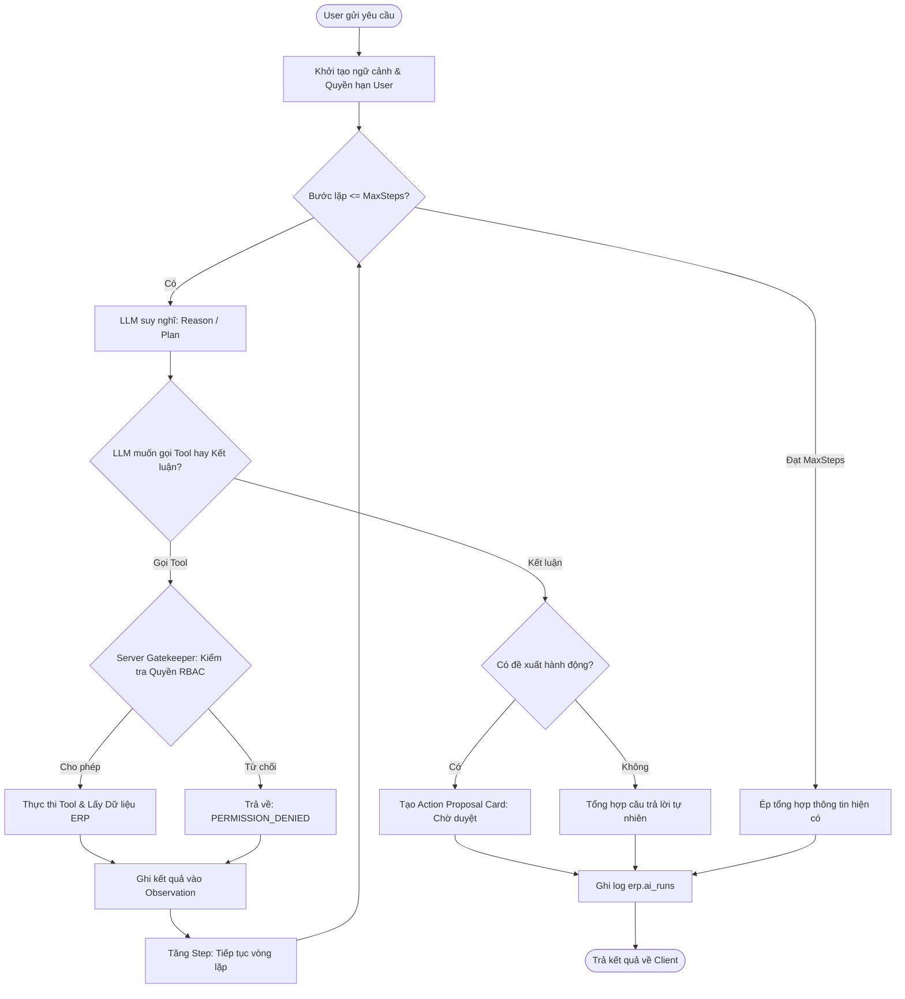
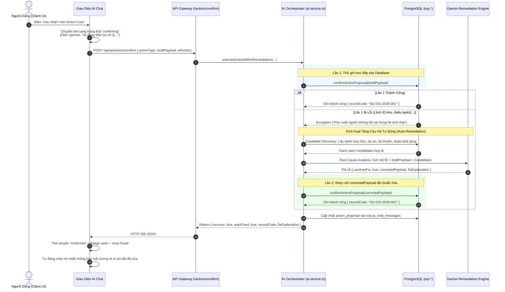

# ĐẶC TẢ KIẾN TRÚC AUTONOMOUS AI AGENT CHO SIGNAGE ERP
## HỆ THỐNG QUẢN TRỊ DOANH NGHIỆP SẢN XUẤT & THI CÔNG BIỂN HIỆU QUẢNG CÁO
**Kiến trúc:** Autonomous ReAct Multi-Step Loop | **Bảo mật:** Zero-Trust RBAC/ABAC Guardrails | **Mô hình AI:** Gemini 3.5 / Astra Engine | **Cơ chế:** Self-Healing & Remediation Loop

---

## 1. Triết Lý Thiết Kế: Từ "Fake Agent" Sang "True Autonomous Agent"

### 1.1. Vấn Đề Của Mô Hình Cũ (Fake Agent)
Trước đây, hệ thống AI bị rơi vào bẫy **"Fake Agent"**:
1. **Prompt Micromanagement (Mê cung chỉ dẫn)**: Nhồi nhét hàng chục quy tắc cứng nhắc kiểu *"Nếu user hỏi X thì bắt buộc gọi tool Y"*, *"Bắt buộc in bảng Markdown cột 1, 2, 3"*. Việc này tước đoạt hoàn toàn khả năng tư duy của mô hình, khiến AI bị "prompt lock-in", bối rối và rơi vào các vòng lặp câu từ rập khuôn (*repetitive loop*).
2. **Regex Interception (Chặn đầu bằng chuỗi ký tự)**: Tầng API bắt từ khóa bằng regex (`p.includes("tiến độ")`, `p.includes("hoàn thành")`) rồi tự ý chuyển hướng luồng mà không cho AI cơ hội suy nghĩ hay đọc ngữ cảnh thực tế.
3. **Single-turn Tool Calling (Thực thi cụt 1 bước)**: AI chỉ được gọi tool 1 lần rồi bị ép trả về kết quả ngay. Không thể thực hiện chuỗi tư duy nghiệp vụ phức tạp: *Tìm dự án -> Xem các công việc chưa xong -> Kiểm tra tồn kho vật tư cần thiết -> Lập đề xuất hành động*.
4. **Thiếu hiểu biết cấu trúc (Schema Blindness)**: AI không có quyền truy vấn từ điển dữ liệu (Schema Discovery) để hiểu cấu trúc các bảng và mối quan hệ trong database, dẫn đến việc phải hardcode hàng loạt tool vụn vặt.
5. **Trải nghiệm lưu dữ liệu mong manh & kém uy tín**: Khi người dùng duyệt hành động, nếu hệ thống ném lỗi ra hộp thoại đỏ (`alert()`, HTTP 500) rồi mới lúng túng gọi AI ra sửa, người dùng sẽ cảm thấy hệ thống rất mỏng manh, thiếu tin cậy và không sẵn sàng cho môi trường doanh nghiệp.

### 1.2. Triết Lý Mới: Tự Do Nhận Thức Trong Ranh Giới Phân Quyền
1. **Agentic Autonomy (Tự chủ nghiệp vụ)**:
   - AI được đóng vai trò một **Kỹ Sư Trưởng kiêm Chuyên Gia Điều Hành Sản Xuất**.
   - AI tự do phân tích mục tiêu của người dùng, tự lập kế hoạch hành động (*Autonomous Planning*) và tự quyết định chuỗi công cụ cần dùng.
2. **Dynamic Schema Discovery (Khám phá cấu trúc động)**:
   - Cung cấp cho AI khả năng tra cứu từ điển thực thể (Data Dictionary / System Schema) để hiểu cấu trúc bảng, các trường dữ liệu và quan hệ khóa ngoại (Foreign Keys).
   - Cho phép AI truy vấn dữ liệu linh hoạt (*Structured Entity Querying* và *Safe Read-only Inspection*) thay vì phụ thuộc vào các hàm cứng.
3. **ReAct Multi-Step Loop (Chuẩn Agent thật)**:
   - Triển khai vòng lặp tư duy đa bước: **Thought (Suy nghĩ) ➔ Action (Gọi Tool) ➔ Observation (Quan sát dữ liệu trả về) ➔ Re-evaluation ➔ Final Answer / Action Proposal**.
   - Agent có thể thực thi tối đa 4-6 bước suy luận liên hoàn để giải quyết bài toán nghiệp vụ trọn vẹn.
4. **Zero-Trust Permission Guardrails (Ranh giới bảo mật tuyệt đối)**:
   - **Tự do suy nghĩ nhưng KHÔNG BAO GIỜ ĐƯỢC VƯỢT QUYỀN**.
   - Mọi thao tác truy vấn của AI đều được chặn ở tầng Server bởi Ma trận Phân quyền Động (RBAC/ABAC Matrix: `capabilities`, `allowedScopes`, Org Isolation).
   - Nếu người dùng thiếu quyền (ví dụ: Thợ hiện trường muốn xem dòng tiền hay số dư quỹ): Tool sẽ trả về `PERMISSION_DENIED` ngay lập tức. AI sẽ giải thích lịch sự lý do từ chối mà không bị lỗi hay lặp lại.
5. **Human-in-the-Loop & Trust-Preserving Auto-Remediation (Xác nhận an toàn & Tự phục hồi ngầm)**:
   - Thao tác ghi dữ liệu luôn có con người kiểm tra (Action Proposal Card).
   - Khi người dùng bấm **Xác nhận**, đây là hành động **ủy thác cho AI tiếp tục xử lý & đối soát để tự lưu**.
   - Nếu xảy ra lỗi dữ liệu (sai ID, thiếu trường liên kết), AI tự động kích hoạt **Vòng lặp tự phục hồi (Self-Healing Loop)** để chuẩn hóa và ghi nhận thành công, bảo toàn tuyệt đối độ uy tín của hệ thống.

---

## 2. Mô Hình Kiến Trúc Kỹ Thuật Tổng Thể

```text
┌────────────────────────────────────────────────────────────────────────┐
│                        CLIENT / USER INTERFACE                         │
│  - Trò chuyện tự nhiên (Chat Canvas & History Sidebar)                 │
│  - Theo dõi suy luận & công cụ (Step Trace & Tool Telemetry)          │
│  - Thẻ duyệt hành động trực quan (Interactive Action Proposal Card)   │
│  - Máy trạng thái mượt mà: pending ➔ confirming ➔ confirmed / needs   │
└───────────────────┬────────────────────────────────┬───────────────────┘
                    │ 1. Hỏi đáp / Tư duy            │ 2. Xác nhận lưu
                    ▼                                ▼
┌──────────────────────────────────────┐  ┌──────────────────────────────┐
│       CHAT ROUTE: /assistant         │  │    CONFIRM ROUTE: /confirm   │
│  - Xác thực Session (Better-Auth)    │  │ - Tiếp nhận Payload duyệt    │
│  - Kiểm tra quyền (ai_run.ask)       │  │ - Không ném lỗi ra alert     │
│  - Ghi nhận lịch sử hội thoại        │  │ - Trả về trạng thái xử lý    │
└───────────────────┬──────────────────┘  └──────────────┬───────────────┘
                    │                                    │
                    ▼                                    ▼
┌────────────────────────────────────────────────────────────────────────┐
│             ORCHESTRATOR LAYER: src/services/ai.service.ts             │
│  - Tải ma trận quyền người dùng: AuthorizationService (Capabilities)   │
│  - ReAct Execution Loop: Suy luận đa bước, tra cứu Schema & Dữ liệu    │
│  - AI Remediation Gateway: executeActionWithAiRemediation              │
│  - Candidate Context Discovery: Lấy danh mục kho, dự án, tài khoản quỹ │
│  - Ghi nhận Audit Log vào erp.ai_runs phục vụ kiểm toán                │
└──────────────┬──────────────────────────┬──────────────┬───────────────┘
               │                          │              │
               ▼                          ▼              ▼
┌──────────────────────────┐  ┌────────────────────┐  ┌──────────────────┐
│   AI REASONING ENGINE    │  │ SECURE ERP TOOLS   │  │ POSTGRESQL & RLS │
│   src/lib/ai/gemini.ts   │  │ assistant.ts       │  │ erp.* Schema     │
│ - Multi-Step ReAct Loop  │  │ - Schema Discovery │  │ (30+ tables)     │
│ - Remediation JSON Gen   │  │ - Entity Querying  │  │ - Projects       │
│ - Gemini 3.5 / Astra     │  │ - Safe SQL Inspect │  │ - Inventory/Stock│
│ - Candidate Matching     │  │ - Action Proposals │  │ - Finance/Fund   │
└──────────────────────────┘  └────────────────────┘  └──────────────────┘
```

---

## 3. Cơ Chế ReAct Multi-Step Loop (Chuẩn Agent Thật)

Khi nhận một câu hỏi nghiệp vụ phức tạp, AI vận hành theo vòng lặp đa bước:



### Ví dụ Về Chuỗi Suy Luận Đa Bước:
* **Yêu cầu:** *"Kiểm tra xem dự án Vincom Bà Triệu cần những vật tư gì, trong kho xưởng còn đủ không và lên đề xuất xuất kho nếu thiếu."*
* **Bước 1 (Thought):** *"Cần tìm thông tin dự án Vincom Bà Triệu để lấy project_id và các mã hạng mục."*
  * **Action:** Gọi `queryEntityData({ entityName: 'projects', filters: { search: 'Vincom Bà Triệu' } })`.
  * **Observation:** Tìm thấy `id: "prj-123"`, mã `PRJ-VCBT`, trạng thái `in_progress`.
* **Bước 2 (Thought):** *"Đã có project_id, giờ kiểm tra danh sách nhiệm vụ và vật tư/BOM cần cho dự án này."*
  * **Action:** Gọi `queryEntityData({ entityName: 'tasks', filters: { project_id: 'prj-123' } })`.
  * **Observation:** Hạng mục *"Ốp mặt tiền Alu"* yêu cầu 20 tấm Alu Alcorest 1.2x2.4m và 5 tuýp keo Titebond.
* **Bước 3 (Thought):** *"Giờ cần kiểm tra tồn kho thực tế của Alu Alcorest và keo Titebond trong kho xưởng."*
  * **Action:** Gọi `searchInventoryStock({ keyword: 'Alu Alcorest' })`.
  * **Observation:** Tồn kho hiện có 14 tấm (thiếu 6 tấm). Keo Titebond còn 10 tuýp (đủ).
* **Bước 4 (Thought):** *"Dữ liệu đã đầy đủ. Cần xuất 14 tấm alu hiện có cho công trình và đề xuất mua thêm 6 tấm. Tạo đề xuất phiếu xuất kho cho 14 tấm trước."*
  * **Action:** Gọi `proposeDataAction({ actionType: 'stock_issue', description: 'Xuất 14 tấm Alu Alcorest cho dự án Vincom', ... })`.
  * **Observation:** Đã tạo bản xem trước (Proposal) với đầy đủ ID và mã SKU thật.
* **Bước 5 (Thought):** *"Hoàn tất chuỗi suy luận. Tổng hợp báo cáo phân tích và trình bày phương án cho người dùng."*
  * **Final Answer:** Trả về báo cáo chi tiết kèm Thẻ xem trước phiếu xuất kho để người dùng bấm duyệt!

---

## 4. Danh Mục Công Cụ Cốt Lõi (Core Toolset)

Hệ thống cung cấp 3 nhóm công cụ:

### 4.1. Nhóm Khám Phá Cấu Trúc & Truy Vấn Linh Hoạt (Discovery & Inspection)
1. `getSystemSchema`:
   - Cho phép AI tra cứu danh mục các bảng, ý nghĩa trường, kiểu dữ liệu và mối quan hệ khóa ngoại (Foreign Keys) trong hệ sinh thái Signage ERP (`projects`, `tasks`, `items`, `warehouses`, `stock_documents`, `partners`, `work_reports`, `employees`, `attendance`, `disbursements`...).
   - Giúp AI hiểu sâu sắc cấu trúc dữ liệu để lên kế hoạch truy vấn chính xác mà không cần đoán mò.
2. `queryEntityData`:
   - Truy vấn động dữ liệu theo thực thể với bộ lọc (filters) và tìm kiếm tự do.
   - Tự động kiểm tra quyền RBAC của thực thể tương ứng (`project.read`, `inventory.read`, `employee.read`...).
   - Tự động áp dụng bộ lọc Tenant (`organization_id`) và Scope (`ORG`, `ASSIGNED`, `OWN`).
3. `executeSafeSqlInspection`:
   - Thực thi truy vấn SQL chỉ-đọc (`SELECT` hoặc `WITH ... SELECT`) dành cho các bài toán phân tích liên kết đa bảng phức tạp.
   - Cơ chế bảo vệ: Chặn 100% lệnh ghi/xóa/sửa (`INSERT`, `UPDATE`, `DELETE`, `DROP`, `ALTER`...), chạy trong readonly transaction, tự động giới hạn `LIMIT 25` và áp dụng `organization_id`.

### 4.2. Nhóm Công Cụ Nghiệp Vụ Chuyên Sâu (Domain Specific Shortcuts)
- `searchInventoryStock`: Tra cứu nhanh danh mục vật tư & tồn kho.
- `getWarehouseStockSummary`: Tổng quan số dư và tình trạng kho.
- `listRemnants`: Tra cứu danh sách tấm lẻ/đề-xê alu, mica dở để tối ưu gia công.
- `searchProjects` & `searchTeamTasks`: Tra cứu dự án, WBS và phân công nhiệm vụ.
- `listWorkReports`: Báo cáo nhật trình thi công hiện trường.
- `listEmployees` & `getAttendanceSummary`: Hồ sơ nhân sự và chấm công.
- `getProjectFinancialOverview`, `getDebtSummary`, `listCashAccounts`: Báo cáo tài chính, dòng tiền và công nợ đối soát.
- `listVehiclesAndTrips`: Điều động đội xe và chuyến hàng.

### 4.3. Nhóm Đề Xuất Hành Động (Human-in-the-Loop Action Proposal)
- `proposeDataAction`:
  - Khởi tạo bản xem trước (Preview) cho 4 hành động cốt lõi:
    1. `work_report`: Báo cáo nhật trình / cập nhật tiến độ công việc.
    2. `stock_issue`: Đề xuất xuất kho cấp phát vật tư.
    3. `acceptance`: Dự thảo biên bản nghiệm thu bàn giao.
    4. `disbursement`: Đề xuất ghi nhận phiếu chi phát sinh hiện trường.
  - Sau khi AI tạo Proposal, giao diện hiển thị Action Card. Người dùng kiểm tra các thông số và bấm **"Xác nhận"**, kích hoạt Tầng Cứu Hộ Tự Động (Mục 5).

---

## 5. Tầng Tự Sửa Lỗi Nghiệp Vụ & Cứu Hộ Dữ Liệu Tự Động (AI Self-Healing & Remediation Loop)

### 5.1. Triết Lý UX: "Trust-Preserving Autonomous Execution"
Trong môi trường doanh nghiệp thực tế, trải nghiệm người dùng đóng vai trò quyết định niềm tin vào hệ thống:
* **Hành vi cũ (Thiếu uy tín - Fragile UX)**: Khi bấm "Xác nhận", hệ thống vội vã báo thành công, hoặc bung hộp thoại báo lỗi đỏ chót (`alert()`, HTTP 500) rồi sau đó mới lúng túng gọi AI ra sửa. Điều này tạo cảm giác hệ thống nghiệp dư, mong manh và thiếu ổn định.
* **Hành vi chuẩn mực mới (Uy tín cao - Autonomous UX)**:
  1. Khi người dùng bấm "Xác nhận", giao diện **KHÔNG** phản hồi lưu thành công ngay lập tức.
  2. Giao diện chuyển ngay sang trạng thái **`confirming` ("AI đang tiếp tục xử lý & đối soát để tự lưu...")** với hiệu ứng tiến trình mượt mà.
  3. AI Agent âm thầm thực thi việc ghi dữ liệu. Nếu gặp bất kỳ lỗi dữ liệu kỹ thuật nào (sai ID, thiếu liên kết kho, lệch mã công việc), AI sẽ **tự động sửa lỗi ngầm (Self-Healing)** và lưu lại.
  4. Người dùng chỉ nhìn thấy kết quả cuối cùng: Chứng từ được tạo thành công kèm huy hiệu `✨ AI đã tự động chuẩn hóa dữ liệu & ghi nhận thành công`.
  5. Nếu gặp lỗi nghiệp vụ bất khả kháng (kho cạn sạch hàng, quỹ không đủ tiền): Thẻ chuyển sang trạng thái nhã nhặn `CẦN ĐIỀU CHỈNH` (`needs_adjustment`), AI gửi tin nhắn giải thích rõ ràng và hướng dẫn người dùng trong chat, tuyệt đối không crash hay bung lỗi thô thiển.

---

### 5.2. Chu Trình 5 Bước Cứu Hộ Dữ Liệu (5-Step Remediation Lifecycle)



---

### 5.3. Chi Tiết Thực Thi Kỹ Thuật (Implementation Details)

#### A. Candidate Discovery (Truy Vấn Danh Mục Thực Thể Khả Dụng)
Khi xảy ra lỗi, `remediateAndRetryActionProposal` tự động nạp ngữ cảnh thực tế từ database:
- **`projects`**: Danh sách dự án đang thực hiện thuộc `organization_id`.
- **`warehouses`**: Danh mục kho xưởng, xe lưu động hợp lệ.
- **`cashAccounts`**: Danh sách quỹ tiền mặt và tài khoản ngân hàng sẵn sàng chi trả.
- **`tasks`**: Danh mục đầu việc WBS khả dụng.
- **`items`**: Danh mục SKU vật tư đã kích hoạt.

#### B. Phân Tích Nguyên Nhân & Chuẩn Hóa Payload (AI Root Cause Analysis)
Gemini Engine được cấp system instruction đóng vai trò **Kỹ sư Tự Phục Hồi Dữ Liệu**:
- Phân tích thông báo lỗi: Phân biệt giữa lỗi **sai lệch định danh / thiếu trường** (có thể tự sửa) và lỗi **ràng buộc thực tế** (hết hàng, hết tiền).
- Tự động thay thế ID rỗng/sai bằng ID hợp lệ tương ứng từ danh mục ứng viên.
- Sinh `correctedPayload` chuẩn xác 100% về mặt cấu trúc và quan hệ khóa ngoại.

#### C. Heuristic Fallback Phản Ứng Nhanh (Fail-Safe Resilience)
Trong trường hợp kết nối AI bị nghẽn mạng:
- Hệ thống áp dụng quy tắc dự phòng nội tại: Tự động gán kho chính (`defaultWh`), hạng mục công việc đầu tiên của dự án, hoặc sổ quỹ mặc định.
- Đảm bảo tỷ lệ hoàn tất giao dịch ghi nhận thực địa đạt tối đa.

---

### 5.4. Máy Trạng Thái Thẻ Hành Động (Action Proposal State Machine)

| Trạng Thái | Hiển Thị Giao Diện | Ý Nghĩa Nghiệp Vụ | Hành Động Khả Dụng |
| :--- | :--- | :--- | :--- |
| **`pending`** | Thẻ xem trước (Nền xanh nhạt / cam) | Bản nháp mới tạo bởi AI, đang chờ người dùng kiểm tra | "Xác nhận" / "Hủy" |
| **`confirming`** | Spinner + Progress Bar xoay nhịp nhàng | **"AI đang tiếp tục xử lý & đối soát để tự lưu..."** | Đang khóa nút, ngăn bấm đúp |
| **`confirmed`** | Huy hiệu Xanh lá + Link chứng từ | Đã lưu thành công vào ERP (kèm badge nếu có AI auto-fix) | Xem chi tiết chứng từ |
| **`needs_adjustment`**| Huy hiệu Vàng hổ phách + Lời giải thích | Gặp xung đột nghiệp vụ cần người dùng bổ sung | "Thử lưu lại" / "Hủy" / Nhắn tiếp |
| **`cancelled`** | Thẻ xám mờ | Bản nháp đã được người dùng hủy bỏ | Không khả dụng |

---

### 5.5. Bảng So Sánh Trải Nghiệm Người Dùng (UX Comparison)

| Tiêu Chí | Mô Hình Cũ (Mong Manh / Kém Uy Tín) | Mô Hình Mới (Signage Autonomous ERP) |
| :--- | :--- | :--- |
| **Phản hồi khi bấm Lưu** | Thông báo lưu thành công ngay hoặc ném lỗi đỏ | Chuyển sang `confirming`: Thông báo AI đang đối soát tự lưu |
| **Khi gặp lỗi ID / thiếu trường**| `alert("Lỗi: warehouse_id is invalid")`, crash | AI âm thầm tìm kho hợp lệ, chuẩn hóa payload và retry thành công |
| **Thông báo khi hoàn tất** | Không có thông tin về việc dữ liệu đã được xử lý | Badge `✨ AI đã tự động chuẩn hóa dữ liệu & ghi nhận thành công` |
| **Khi gặp lỗi bất khả kháng** | Báo lỗi 500 kỹ thuật không hiểu được | Lịch sự giải thích lý do nghiệp vụ (hết hàng, hết tiền) trong chat |
| **Cảm nhận của người dùng** | Hệ thống mỏng manh, chắp vá, sợ bấm nút | Hệ thống thông minh, tự chủ, tin cậy tuyệt đối |

---

## 6. Ma Trận Phân Quyền & Kiểm Soát An Toàn (Security Matrix)

Mọi yêu cầu gọi công cụ từ AI đều được thẩm định độc lập phía Server:

| Nhóm Dữ Liệu / Thực Thể | Quyền Cần Thiết (IAM Key) | Phạm Vi Áp Dụng (Scopes) | Xử Lý Khi Thiếu Quyền |
| :--- | :--- | :--- | :--- |
| **Dự án & Nhiệm vụ** | `project.read`, `task.read` | `ORG`, `ASSIGNED`, `OWN` | Trả về `PERMISSION_DENIED` |
| **Kho & Vật tư** | `inventory.read`, `item.read` | `ORG`, `ASSIGNED` | Trả về `PERMISSION_DENIED` |
| **Phiếu kho xuất/nhập** | `stock_document.read` | `ORG`, `ASSIGNED` | Trả về `PERMISSION_DENIED` |
| **Nhân sự & Chấm công** | `employee.read`, `attendance.read`| `ORG`, `TEAM`, `OWN` | Trả về `PERMISSION_DENIED` |
| **Tài chính, Sổ quỹ, Dòng tiền**| `project_finance.read`, `payment.read`| `ORG` | Trả về `PERMISSION_DENIED` |
| **Công nợ phải thu / phải trả**| `receivable.read`, `payable.read` | `ORG` | Trả về `PERMISSION_DENIED` |
| **Khách hàng & Bán hàng** | `customer.read` | `ORG`, `OWN` | Trả về `PERMISSION_DENIED` |
| **Mua hàng & Nhà cung cấp** | `purchase_order.read`, `supplier.read`| `ORG`, `OWN` | Trả về `PERMISSION_DENIED` |
| **Truy vấn SQL An Toàn** | `ai_run.ask` + Admin/SuperAdmin | `ORG` | Chỉ-đọc, không vượt Tenant |

> [!IMPORTANT]
> **Nguyên Tắc Bất Biến:** AI không bao giờ có "quyền lực tuyệt đối". Quyền của AI tại mỗi phiên chat chính là quyền của người dùng đang đăng nhập (`session.user.id`). Nếu một nhân viên hiện trường (FIELD_WORKER) yêu cầu xem báo cáo công nợ hoặc số dư quỹ ngân hàng, AI sẽ nhận kết quả từ chối từ Server và phản hồi giải thích trung thực về chính sách phân quyền nội bộ. Đồng thời, tầng AI Remediation chỉ được chuẩn hóa ID hợp lệ trong phạm vi phân quyền của người dùng, không bao giờ vượt quyền ghi của phân hệ khác.

---

## 7. Lợi Điểm Vượt Trội Của Kiến Trúc Mới

1. **Không Còn Vòng Lặp Bế Tắc (No Repetition Maze)**: Loại bỏ các prompt nhồi nhét quy tắc máy móc, trao lại quyền tư duy và lập kế hoạch cho mô hình ngôn ngữ lớn.
2. **Khả Năng Xử Lý Tình Huống Nghiệp Vụ Phức Tạp**: Nhờ vòng lặp ReAct đa bước và khả năng tra cứu Schema, AI có thể tự kết nối dữ liệu giữa nhiều phân hệ (Dự án ➔ Nhân sự ➔ Kho ➔ Tài chính) để đưa ra câu trả lời sâu sắc.
3. **An Toàn Doanh Nghiệp (Enterprise-grade Security)**: Đảm bảo 100% tuân thủ mô hình bảo mật Zero-Trust, cách ly Tenant tuyệt đối và có con người duyệt trước khi ghi dữ liệu.
4. **Khả Năng Tự Phục Hồi & Trải Nghiệm Uy Tín (Self-Healing & Unshakable System Trust)**: Cơ chế `confirming ➔ auto-remediation` biến AI thành một cộng sự đắc lực biết tự xử lý các va vấp kỹ thuật ngầm, giữ cho trải nghiệm người dùng luôn mượt mà và tôn trọng uy tín của hệ thống phần mềm doanh nghiệp.
5. **Minh Bạch & Kiểm Toán Toàn Diện (Full Telemetry & Auditability)**: Từng bước suy nghĩ, công cụ đã gọi, nguồn dữ liệu đối soát, lịch sử tự sửa lỗi và cảnh báo quyền đều được lưu lại đầy đủ trong `erp.ai_runs` và `erp.ai_chat_messages`.
